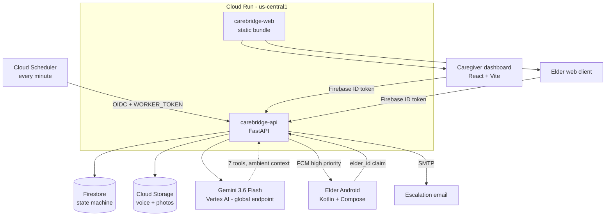

# CareBridge

**A medication reminder that reaches an elderly person who will never open an
app — and a dashboard that tells their family the truth about what happened.**

| | |
| --- | --- |
| **Live app** | https://carebridge-web-gdjifq5mea-uc.a.run.app |
| **API health** | https://carebridge-api-gdjifq5mea-uc.a.run.app/health |
| **Demo video** | https://youtu.be/j11t-fBFuL0 (unlisted) |
| **Stack** | Cloud Run · Firestore · Gemini 3.6 Flash on Vertex AI · Google ADK |

---

## Problem

An 80-year-old with five prescriptions will not open a medication app. She will
not tap a daily checklist. Reminder apps assume a user who engages with a
phone; the person who most needs the reminder is the person least likely to
engage with one.

So the family improvises: a phone call at 8am, a WhatsApp message, a pillbox
someone refills on Sunday. Nobody actually knows whether the tablet was taken.

And the tools that claim to answer that question make it worse. Adherence
products almost universally report **doses taken ÷ doses scheduled** — a single
number that cannot tell the difference between a woman ignoring her tablets and
a phone that nobody set up. The family is handed "62% adherence" and blames
their mother for an infrastructure failure.

## Solution

CareBridge reaches *out* at medication time instead of waiting to be opened.
The elder's phone wakes itself over the lock screen, shows a photograph of the
tablet, and plays a recording **in her daughter's own voice**. She answers out
loud — "I took it", "remind me in ten minutes", "which one is this?" — and a
Gemini agent works out what she meant.

When nobody answers, the family is told what was tried and when.

And the dashboard never reports one number. It reports three that add up, so a
family can see whether a dose was refused or simply never asked.

## Why an agent?

A traditional application would need the elder to press the right button. The
whole premise here is that she won't.

An agent is doing three things a rules engine cannot:

1. **Understanding open speech.** "Already had it with my breakfast", "give me
   a bit", "is this the white one?" are the same three intents in unbounded
   phrasing, in English or Telugu, from someone who may be half-asleep.
2. **Knowing when it does not know.** The agent has a tool whose entire purpose
   is to decline — `report_unclear_reply`. When it cannot tell what an answer
   meant it says so rather than guessing the likeliest reading. A classifier
   forced to pick a label would silently mark doses taken.
3. **Writing to a worried family in their own language.** A second agent turns
   final adherence figures into a sentence a person can read.

**What the agent is *not* allowed to do is just as important.** It cannot
change a dose, edit a schedule, give medical advice, or reach another family's
records. It interprets; the backend decides.

## Key features

- **Voice-first reminders** — a family member records the reminder themselves;
  the elder hears someone she trusts, not a synthesised stranger.
- **Full-screen wake on a locked Android phone** — FCM high-priority push, over
  the lock screen, with the tablet photo.
- **Open-speech replies** — confirm, snooze, decline, or ask what a medicine is,
  in plain language, in English or Telugu end to end.
- **The honesty ledger** — three numbers that partition exactly
  (`scheduled == asked + unreachable + not_yet_due`), so an unreachable dose is
  labelled *ours to fix*, never counted against the elder.
- **Escalation that never waits on a model** — push immediately, then an email
  five minutes later carrying what was tried and when.
- **Care teams and paired devices** — several family members per elder;
  single-use pairing codes valid three days; a "Check it works" self-test that
  exercises the whole chain and reports back.
- **Courses, food notes and photographs** — dose, times of day, with/without
  food, and a course end date after which the reminders stop.

## How it works

```
Cloud Scheduler (every minute)
        ↓
Worker: materialise today's doses · act on what is due
        ↓
FCM push  →  elder's locked phone wakes, plays the family voice
        ↓
Elder speaks
        ↓
Gemini agent (7 tools, no database access)  →  interprets intent
        ↓
Backend state machine  →  validates the transition inside a Firestore txn
        ↓
TAKEN / SNOOZED / DECLINED  —  or, on silence, ESCALATED
        ↓
Family: dashboard ledger · push · email
```

The event is the unit of state:

```
PENDING → REMINDER_SENT → TAKEN
                        → DECLINED
                        → SNOOZED → REMINDER_SENT → ESCALATED
```

`next_attempt_at` is what the worker polls; terminal states clear it, which is
how a confirmed medication drops out of the query with a single inequality
filter and no composite index. Transitions are applied inside a Firestore
transaction and rejected if illegal, so a race between the elder tapping
"I took it" and the worker escalating cannot produce a confused record.

## Architecture



| Path | What it is |
| --- | --- |
| `backend/` | FastAPI on Cloud Run: API, state machine, ADK agents, worker |
| `frontend/` | React + Vite: caregiver dashboard and an elder web client |
| `elder-android/` | Kotlin + Compose elder app with FCM full-screen reminders |
| `infrastructure/` | Deploy script, Firestore and Storage rules |

## Agent architecture

**The agent decides what the elder meant. The backend decides what happens.**

The companion agent has seven tools and no other database access. None of them
takes an elder id or an event id as an argument — those come from an ambient
request context set from the caller's credentials, so the model cannot reach
another family's records by inventing an identifier.

```
get_current_reminder      get_medication_instructions
confirm_medication_taken  snooze_reminder
record_decline            report_unclear_reply
notify_caregiver
```

`report_unclear_reply` is the one that does nothing. When the model cannot tell
what an answer meant it says so, instead of choosing the likeliest reading: the
dose does not move, what was heard is kept, and after the second one a person
is asked to step in. That threshold is a counter in the backend, never a
judgement the model makes turn by turn.

**The second agent explains; it never decides.** `adherence_analyst_agent` has
no tools at all — it cannot read the database or reach a household. It is handed
a brief of figures that are already final and asked to write them out for a
worried family. That is what makes a model safe here: by the time it runs, the
decision is made and the first alert has already been sent.

The escalation ladder shows the rule directly. Rung one is a push carrying the
sentence the backend wrote, sent immediately. Rung two, five minutes later, is
an email carrying the analyst's wording — and if the analyst is slow, off or
broken, it carries the same plain sentence rung one did. **The alert never waits
for the model.** The weekly note behaves the same way: `plain_weekly_note` is
what a family reads when Gemini is unavailable, so the note is a feature of
CareBridge rather than of the model being up.

### Two numbers, kept apart

Every figure comes from `models/adherence.py`, which counts reach and outcome
separately and partitions exactly:

```
scheduled == asked + unreachable + not_yet_due
```

The dashboard shows all three, so a family can add them up rather than trust
them. `services/adherence_service.py` computes every rate, median and
week-on-week comparison in plain Python — no model involved.

## Demo

The fastest path to seeing the whole loop, without waiting for a clock:

1. Open the dashboard and **add a person**.
2. **Add a medication** — dose, times, food note, course, photo.
3. **Record the reminder** in your own voice, then press *Hear it*.
4. Press **Remind now**. This fires the reminder immediately.
5. **Pair this browser as …** and switch to the elder view to answer it — by
   button, or by speaking (Chrome or Edge; speech input does not exist in other
   browsers).
6. Back on the dashboard, watch the three numbers move, and the status label on
   the dose change.

To see an escalation, simply do not answer: the worker retries on its own
schedule and then emails the second caregiver.

## Tech stack

| Layer | What |
| --- | --- |
| API | FastAPI 0.141, Python 3.12, on Cloud Run |
| Agents | Google ADK 2.7, `google-genai` 2.18, Gemini 3.6 Flash on Vertex AI |
| Data | Firestore (transactional state machine), Cloud Storage (voice, photos) |
| Scheduling | Cloud Scheduler → worker endpoint, once a minute |
| Push | Firebase Cloud Messaging, high priority, full-screen intent |
| Auth | Firebase Authentication; custom tokens with an `elder_id` claim |
| Secrets | Secret Manager (worker token) |
| Web | React 19, TypeScript 6, Vite 8 |
| Android | Kotlin, Jetpack Compose |

## Getting started

Requires Python 3.12, Node 20+, and `gcloud auth application-default login`
against a project with Firestore, Cloud Storage and Vertex AI enabled.

```bash
# backend
cd backend
python -m venv .venv && .venv/Scripts/activate    # or source .venv/bin/activate
pip install -r requirements.txt
cp .env.example .env                              # then fill in your project
uvicorn app.main:app --reload --port 8000

# frontend, in another terminal
cd frontend
npm install
npm run dev                                       # http://localhost:5173
```

If the API is not on port 8000, put `VITE_API_URL=http://127.0.0.1:<port>` in
`frontend/.env.local`.

### Verifying it

```bash
cd backend
pytest                       # 254 pass, no network needed
python scripts/e2e_demo.py   # real Firestore, real GCS, real Gemini
```

`pytest` also reports 36 errors in the device-pairing tests: their fixture
patches a Firebase symbol that only exists when credentials are present, so
they cannot collect locally. They are a fixture defect, not failing behaviour,
and are deliberately left until after submission rather than changing a test
count already published elsewhere.

`scripts/e2e_demo.py` walks both storylines end to end: a conversation that
ends in a confirmation, and a silence that ends in an escalation. It also
asserts the safety rules — that "Okay." is not a confirmation, that the agent
refuses to change a dose, and that the alert says *not confirmed* rather than
*not taken*.

### Deploying

```bash
PROJECT_ID=your-project ./infrastructure/deploy.sh
```

Creates the service accounts and roles, stores a generated worker token in
Secret Manager, deploys to Cloud Run with `AUTH_ENABLED=true`, and creates the
once-a-minute scheduler job.

Note that Gemini 3.x is served from Vertex's **global** endpoint, not a region.
`GCP_LOCATION=global` is deliberate; `us-central1` returns 404 for
`gemini-3.6-flash`.

## Security and safety

| Rule | Enforced in |
| --- | --- |
| Ambiguity is never a confirmation | agent prompt |
| No dose, schedule or instruction changes | agent prompt; no tool can do it |
| Food-instruction conflicts get the record, not advice | agent prompt |
| Snooze bounded to 1–60 minutes | `medication_tools.snooze_reminder` |
| Finished events cannot be reopened | `medication_event.ALLOWED_TRANSITIONS` |
| Silence is "not confirmed", never "not taken" | `reminder_service._escalate` |
| One family cannot see another's records | `auth.require_elder_access` |
| An answer nobody understood is recorded, not guessed | `medication_tools.report_unclear_reply` |
| Two unclear replies fetch a human | `settings.max_unclear_replies` |
| Adherence is never divided by undelivered doses | `adherence_service.adherence_of_asked` |
| An escalation is never delayed by the analyst | `reminder_service._narrated` |

Every one of these has a test.

### Authentication

`AUTH_ENABLED=false` — the default in `settings.py`, and overridden to `true`
by `deploy.sh` — lets callers identify themselves with an `X-Caregiver-Id` or
`X-Elder-Id` header. That is for local development only; the deployed service
runs with authentication on.

With `AUTH_ENABLED=true` caregivers must present a Firebase ID token, and elder
devices must present one carrying an `elder_id` claim, obtained by exchanging
the custom token from `mint_elder_pairing_token`. Ownership is checked on every
request either way — the header mode changes who you can claim to be, not what
that person is allowed to reach.

The worker endpoint is separately protected by `WORKER_TOKEN`, which Cloud
Scheduler sends as a header on top of its OIDC identity, compared in constant
time. The service refuses to start if that secret is still the placeholder
published in this repository.

The API is publicly invokable, which is deliberate: application-layer
authentication is the gate, not the Cloud Run invoker policy. `deploy.sh` pairs
the two, granting public invocation only when `AUTH_ENABLED=true`.

## Deployment status

Live on Cloud Run in `us-central1` as two services: `carebridge-api` and
`carebridge-web`, the latter serving both the caregiver dashboard and the elder
web client.

Cloud Scheduler drives `POST /api/internal/reminders/process` every minute, and
that loop is verified in production, not just locally:

```
Fired attempt 1, then touched nothing.
  [ 20s] REMINDER_SENT attempt=1
  [ 61s] REMINDER_SENT attempt=2   <- scheduler, unaided
  [123s] ESCALATED     attempt=2   <- scheduler, unaided

Alert: "Amma has not confirmed the 5:06 AM Metformin after 2 reminder attempts."
```

```bash
URL="$(gcloud run services describe carebridge-api \
  --region us-central1 --format 'value(status.url)')"

python backend/scripts/verify_deployed.py "$URL"    # 11 checks, live Gemini
python backend/scripts/verify_escalation.py "$URL"  # scheduler drives it alone
```

`verify_escalation.py` earns its keep: it fires one reminder and then refuses
to touch the system, so a scheduler that is not actually driving the loop
fails. It caught a production-only bug that every local test passed through.

## Limitations

Stated plainly, because a medication tool that overstates itself is dangerous.

- **Delivery cannot be confirmed.** A dose counts as *asked* when a device is
  registered, or when the elder replies. Registration is a database fact, not a
  delivery receipt, and a push result means "accepted for delivery", not
  "arrived". The one unambiguous evidence of arrival is a reply, and a reply is
  what sets that flag. The interface says "had somewhere to send to", never
  "was received".
- **The conversational agent has no timeout.** The analyst agent runs under an
  eight-second timeout with a deterministic fallback, so escalation never waits
  on a model. The companion agent has no equivalent guard; a stalled call
  blocks one spoken turn until the platform request timeout. The button
  controls bypass the agent entirely, so a dose is still recordable.
- **Declining has no button.** `record_decline` works end to end and is tested,
  but neither client exposes a control for it — a decline can only be recorded
  by speaking.
- **The caregiver alert list is not elder-scoped.** A caregiver looking after
  two people sees both sets of alerts in one list.
- **Multi-caregiver escalation is single-tier.** Every caregiver on the elder
  gets the same alert; there is no primary/secondary/emergency ladder yet.
- **Two languages, not five.** English and Telugu are complete end to end —
  agent prompt, spoken time phrasing, UI copy and the Android client. Hindi,
  Tamil and Kannada have a synthesised voice and a speech tag but no interface
  copy, so an elder set to Hindi would hear a Hindi voice reading an English
  time phrase.
- **Database rules are defined, not deployed.** `infrastructure/` holds
  deny-all Firestore and Storage rules, and no client touches either directly,
  but `deploy.sh` does not apply them.
- **No rate limiting, monitoring or retention policy.** Pairing is protected by
  code entropy and an identical failure response, not by throttling. Logs are
  unstructured and nothing is alerted on. Records are never deleted.

## Future enhancements

Delivery receipts via FCM callbacks, so *asked* can become *arrived*. A timeout
and fallback on the companion agent. A decline button on both clients. Interface
copy for Hindi, Tamil and Kannada. A tiered escalation ladder ending at an
emergency contact. Applying the Firestore rules from `deploy.sh`.

## Impact

Non-adherence is one of the most expensive solved-on-paper problems in medicine
— the tablets exist, the prescription is correct, and the dose is still missed.
For an elderly person living alone, the failure is rarely refusal. It is that
nobody asked in a way she could answer.

CareBridge is built on the belief that the honest version is more useful than
the flattering one. It would be easy to report a single adherence percentage
and let a family assume the worst of their mother. Instead it separates what
was asked from what was answered, names its own failures *ours to fix*, and
refuses to claim a reminder arrived when it only knows the reminder was sent.

A family that trusts the numbers will act on them. That is the whole product.
